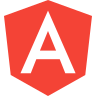

<h1 align="center">Hi 👋, I'm <a href="https://lwnadev.neocities.org" target="blank" style="color:#9800FF;">LwnaDev</a>!</h1>
<h3 align="center">I love bass music, programing and maths!</h3>

âš¡ Bass Music, âš›ï¸ Time Traveler, 🌠Astronomy, 🧪 Medicine

**Contact me on Discord: NexDrak#9439** 

  
</a>

 <h2 align="center">My Music Profiles</h2>

Some of my other networks with my artist name NexDrak.
 

<h2 align="center">Skills</h2>

A summary of my programming skills.

 

 

<h2 align="center">Pinned Repositories</h2>

Take a look at my most outstanding repositories.

